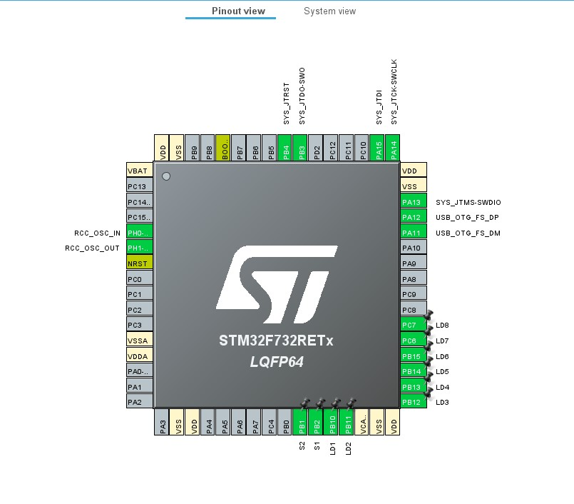
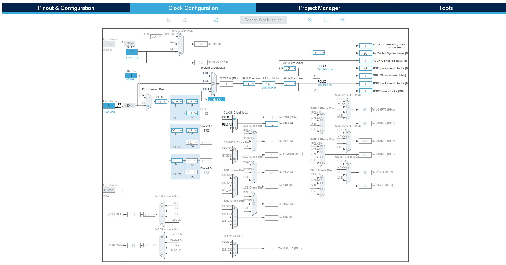
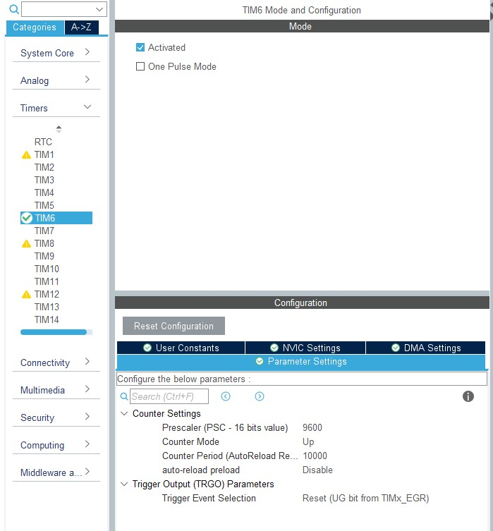
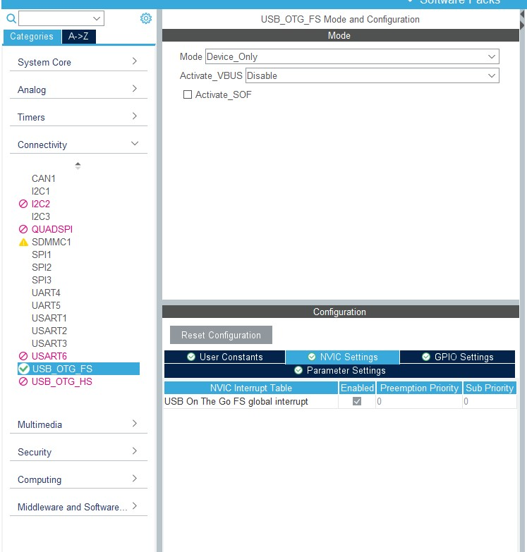
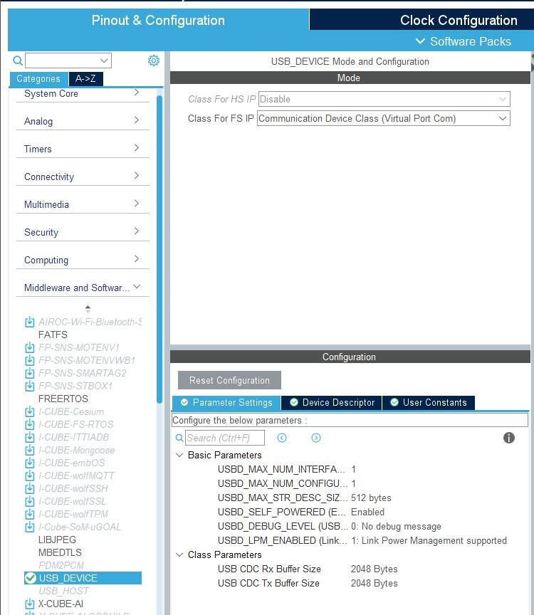
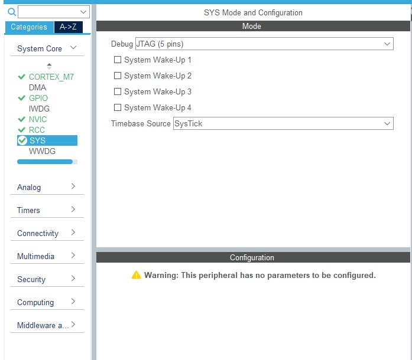

# Deska STM32F732RET6
### Pro projekt, byla použita deska STM32F732RET6 od firmy STMicroelectronics.

Deska obsahuje výkonný 32bitový procesor `ARM® Cortex®-M7` s frekvencí až 216 MHz. Má jednotku `FPU`, adaptivní akcelerátor `ART` a 8 KB L1 cache pro instrukce i data. Výkon dosahuje 462 DMIPS.

 **Paměť:**
 512 KB `Flash`, 256 KB `SRAM`, 4 KB zálohované `SRAM`. Podporuje externí paměti (`SRAM`, `SDRAM`, `NAND`, `NOR`).

 **Napájení:**
 1,7V–3,6V, USB napájení, různé zdroje hodin (interní `RC`, krystal 4–26 MHz).

Deska má 3×12bit `ADC` (24 kanálů, až 7,2 MSPS), 2× 12bit `DAC` a až 18 časovačů (2× 32bit, 13× 16bit).

Podporuje až 140 I/O, 136 rychlých I/O (až 108 MHz) a 138 5V-tolerantních pinů. Má až 21 komunikačních rozhraní včetně `I²C`, `UART`, `SPI`, `CAN`, `SDMMC` a `USB 2.0 FS/HS`.

Podporuje hardwarové šifrování AES (128/256 bit), RNG, CRC, RTC s kalendářem a 96bit unikátní ID.

# CubeIDE a Matlab

Pro projekt, bylo použito jako vývojové prostředí pro programování desky CubeIDE a Matlab se svým App Designerem, který umožní výtvořit grafickou aplikaci. Pro projekt
byla použita licence poskytována univerzitou.

# Vývoj programu v CubeIDE

Program je napsán v jazyce C, který je ideální pro systémy s omezenými výpočetními zdroji díky své efektivitě a rychlosti.

## Konfigurace pinů

### Tato konfigurace zajišťuje základní funkce zařízení, včetně USB komunikace, ovládání LED diod a možnosti ladění přes SWD.

### USB komunikace  
- `PA11` – **USB_OTG_FS_DM**  
- `PA12` – **USB_OTG_FS_DP**  

### LED indikátory  
- `PC6` – **LED8**  
- `PC7` – **LED7**  
- `PB15` – **LED6**  
- `PB14` – **LED5**  
- `PB13` – **LED4**  
- `PB12` – **LED3**  

### Tlačítka (S1, S2)  
- `PA0` – **S1**  
- `PA1` – **S2**  

### JTAG/SWD debug  
- `PA13` – **SYS_JTMS-SWDIO**  
- `PA14` – **SYS_JTCK-SWCLK**  



## Nastavení časovače

Hodiny jsou nakonfigurovány tak, aby SYSCLK běžel na **96 MHz**, přičemž APB1 Timer Clocks jsou nastaveny na **96 MHz**.




## Aktivace časovače TIM6

### Parametry nastavení:
- **Prescaler (PSC - 16bit)**: 9600
- **Counter Mode**: Up
- **Counter Period (ARR)**: 10000
- **Auto-reload preload**: Disabled
- **Trigger Event Selection**: Reset (UG bit from TIMx_EGR)

TIM6 je často používán jako základní časovač pro generování časových zpoždění nebo pro spouštění dalších periferií.

Následující obrázek ukazuje konfiguraci časovače TIM6 ve STM32CubeIDE:


## Konfigurace USB

### Konfigurace USB_OTG_FS

USB On-The-Go (OTG) umožňuje zařízení fungovat jako **hostitel (Host)** nebo **zařízení (Device)**. V této konfiguraci je nastaven režim **Device Only**, což znamená, že zařízení bude fungovat jako koncový USB prvek, například virtuální sériový port.

### Nastavení:
- **Režim:** Device_Only  
- **Aktivace VBUS:** Disabled  
- **NVIC Interrupt:** Aktivován s prioritou (0,0)  

Tato konfigurace umožňuje mikrokontroléru komunikovat s počítačem jako USB zařízení:


---

### Konfigurace USB Device

Tato konfigurace definuje, jakým způsobem bude USB zařízení fungovat. V tomto případě je vybrána třída **Communication Device Class (CDC)**, která umožňuje zařízení emulovat **virtuální sériový port (VCP)**. Tento port se následně zobrazí v systému jako běžný COM port.

#### Klíčové parametry:
- **Class For FS IP:** Communication Device Class (Virtual Port Com)  
- **Maximální počet rozhraní:** 1  
- **Maximální počet konfigurací:** 1  
- **Velikost řetězcového deskriptoru:** 512 bajtů  
- **Podpora LPM (Low Power Management):** Enabled  
- **Velikost bufferu pro přenos dat:** 2048 bajtů  

Tato konfigurace umožňuje zařízení být rozpoznáno jako virtuální COM port v počítači.


---

### Konfigurace systému (SYS)

V této části se nastavují globální systémové parametry. Debugovací rozhraní je zde nastaveno na **`JTAG (5 pinů)`**, což umožňuje ladění pomocí externích nástrojů. Časová základna je nastavena na **`SysTick`**, což je hlavní časovač pro generování přerušení systému.

### Nastavení:
- **Debug rozhraní:** `JTAG` (5 pinů)  
- **Systémové probuzení:** Žádné (všechny možnosti jsou vypnuté)  
- **Časová základna:** `SysTick`  




# Vývoj Matlab aplikace 

Aplikace vytvořená v prostředí App Designer v Matlabu slouží pro komunikaci se zařízením STM32 přes USB sériový port (CDC). Komunikace probíhá pomocí předdefinovaných funkcí pro odesílání a příjem dat. Dle identifikátoru (`ID`) je možné provádět různé akce jako například odesílání požadavků, generování a přenos testovacích dat nebo vizualizaci.

## Příjem dat

Funkce `readDataSTM32` slouží k načítání dat ze STM32 prostřednictvím sériové komunikace. Jako vstup přijímá objekt sériového portu a vrací identifikátor přijatých dat, počet datových bloků a samotná data.

Pokud je dostupné dostatečné množství dat, funkce nejprve načte identifikátor zprávy a počet datových bloků. Pokud nejsou žádná data k dispozici, funkce se ihned ukončí.

Podle hodnoty identifikátoru se následně rozhodne, jaký formát dat bude použit. Pokud je identifikátor větší než 32 768, data se načtou ve formátu `single`, jinak ve formátu `uint32`. Celý proces je obalen blokem `try-catch`, aby bylo možné zachytit případné chyby a zobrazit chybovou zprávu.

```
function [iD, nData, xData] = readDataSTM32(s)
    try
        if s==0
            return
        end
        iD=0; nData=0; xData=0;
        if(s.NumBytesAvailable>3)
            iD = read(s, 1, "uint16");
            nData = read(s, 1, "uint16");
            if nData==0
            return;
            end
            if iD > 2^15
                if isReady(s, nData*4)
                    xData= read(s, nData, "single");
                end
            else
                if isReady(s, nData*4)
                    xData= uint32(read(s, nData, "uint32"));
                end            
            end
        end
    catch ME
                disp(ME.message)  
    end
end
```

## Odesílaní dat 

Funkce `writeDataSTM32` slouží k odesílání dat do STM32 přes sériovou komunikaci. Jako vstup přijímá objekt sériového portu, identifikátor datového paketu, počet odesílaných datových bloků a samotná data.

Identifikátor slouží k rozlišení typu zprávy, zatímco `nData` určuje počet odesílaných hodnot. Data mohou být ve formátu `single` nebo `uint32`, přičemž správný formát se volí podle hodnoty identifikátoru.  

```
function writeDataSTM32(s, iD, nData, xData)
    try
        if s==0
            return
        end
        write(s,iD,"uint16");
        write(s,nData,"uint16");
        if nData==0 
            return;
        end
        if iD > 2^15
            write(s,xData(1:nData),"single");
        else
            write(s,xData(1:nData),"uint32");
        end
    catch ME
        disp(ME.message)   %             rethrow(ME)
    end
end

```

# Odeslání dat podle ID požadavku
Funkce `ELM_POOL_Extern_Button_ID` slouží jako pomocná metoda v aplikaci vytvořené pomocí App Designeru v Matlabu. Jejím úkolem je na základě zadaného identifikátoru `ID` vygenerovat odpovídající datový paket a odeslat jej přes sériovou linku do zařízení STM32 pomocí funkce `writeDataSTM32`.

Funkce přijímá dva vstupy – objekt aplikace `app`, který obsahuje objekt sériového portu `app.s`, a číselný identifikátor `ID`. Pokud není `ID` zadáno, použije se výchozí hodnota `10001`.

### Pro různé hodnoty `ID` funkce provádí různé akce:
Pokud je `ID = 10001`, odešle se základní příkaz bez jakýchkoliv dat.

Pokud je `ID = 40002`, funkce nejprve vygeneruje testovací data, která následně odešle ve formátu `single`. Tato data mohou být například využita pro otestování komunikace nebo zobrazení v grafu.

Celý proces je obalen blokem `try-catch` pro zachycení případných chyb a zajištění plynulého běhu aplikace.

```
function [iD, nData, xData] = readDataSTM32(s)
    try
        if s==0
            return
        end
        iD=0; nData=0; xData=0;
        if(s.NumBytesAvailable>3)
            iD = read(s, 1, "uint16");
            nData = read(s, 1, "uint16");
            if nData==0
            return;
            end
            if iD > 2^15
                if isReady(s, nData*4)
                    xData= read(s, nData, "single");
                end
            else
                if isReady(s, nData*4)
                    xData= uint32(read(s, nData, "uint32"));
                end            
            end
        end
    catch ME
                disp(ME.message)  
    end
end
```