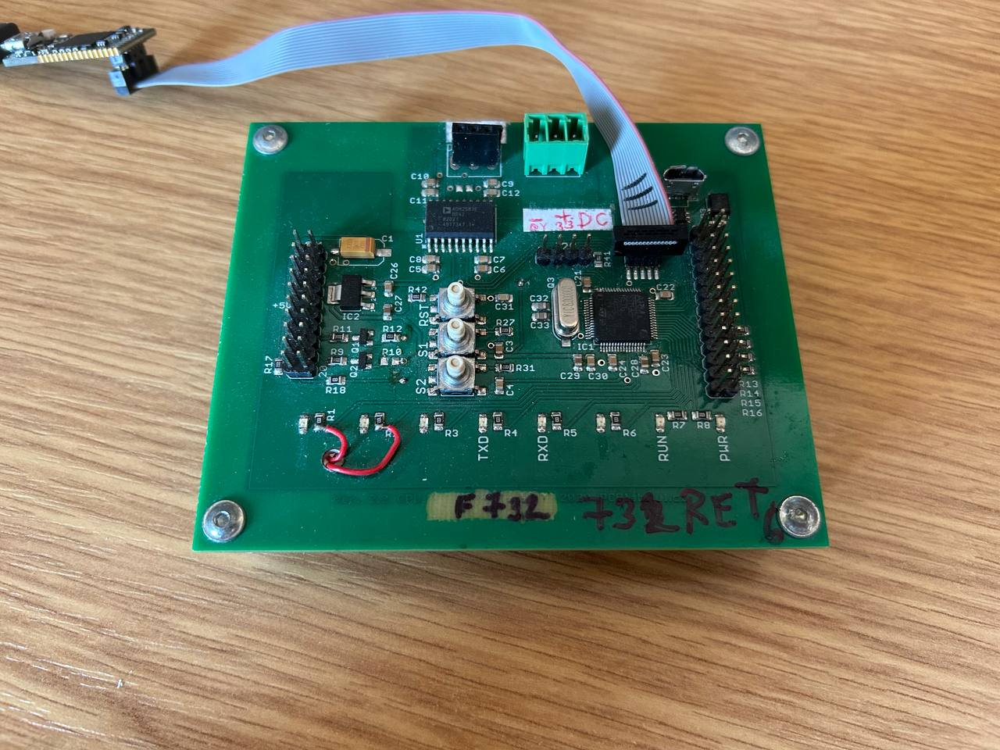
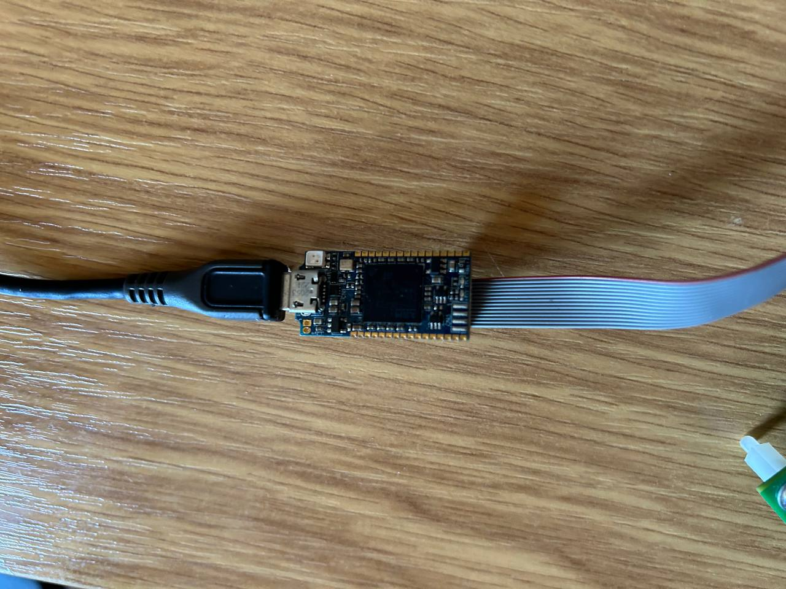
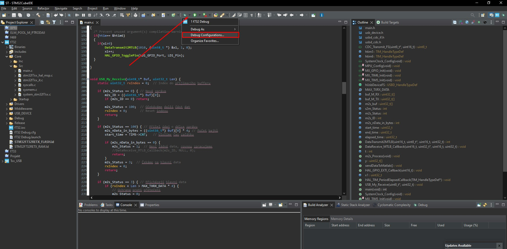
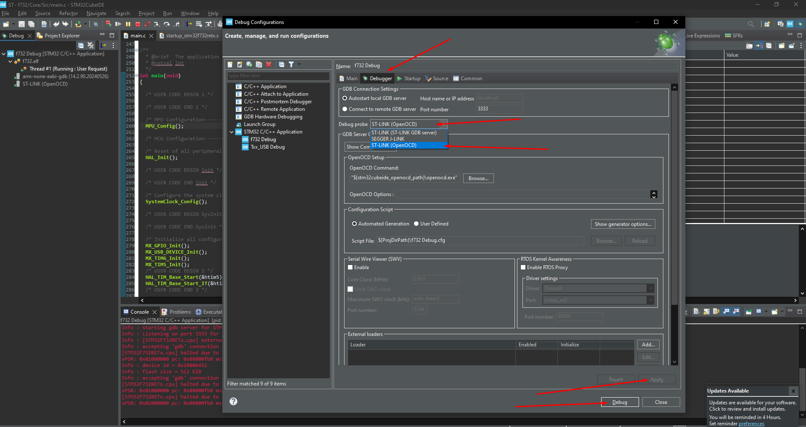
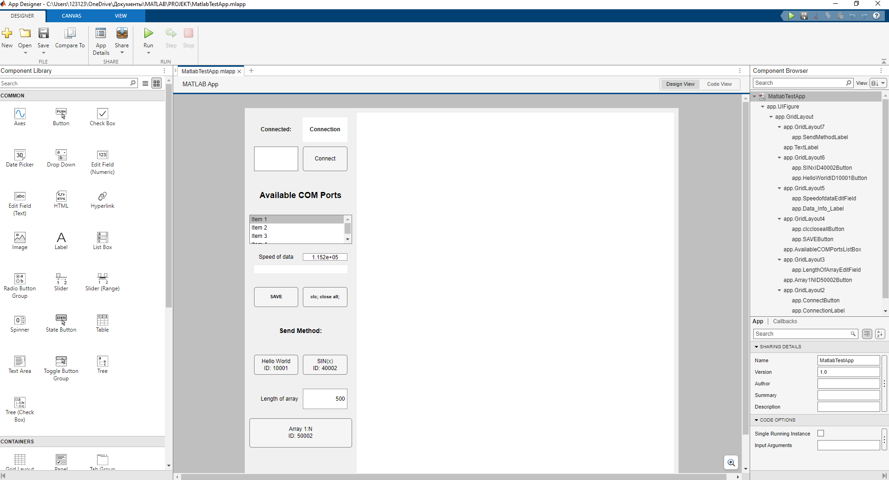
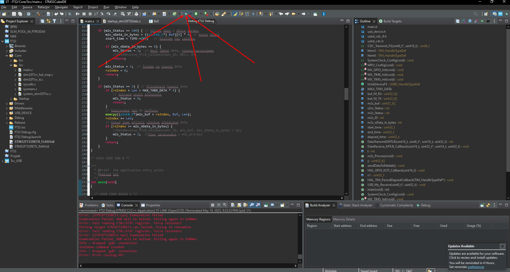
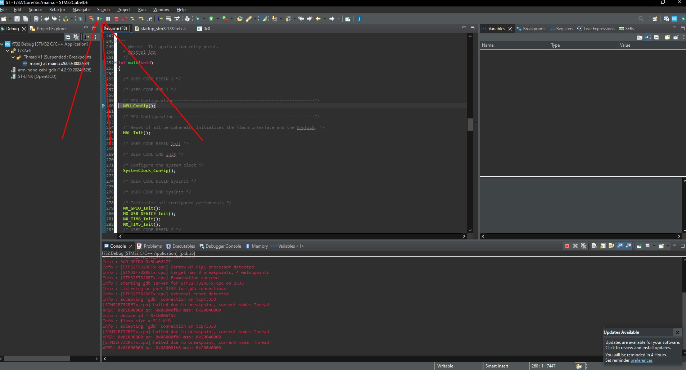
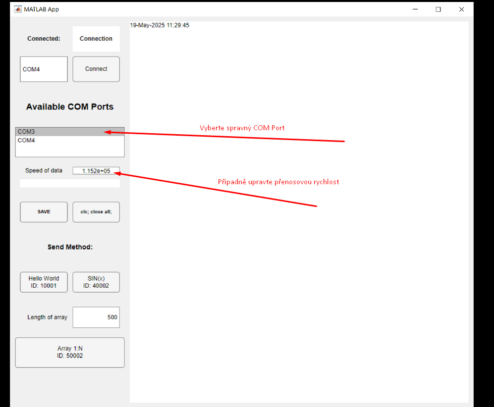
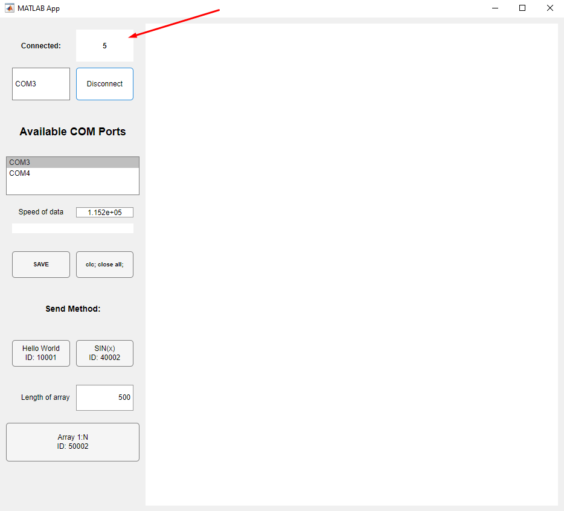
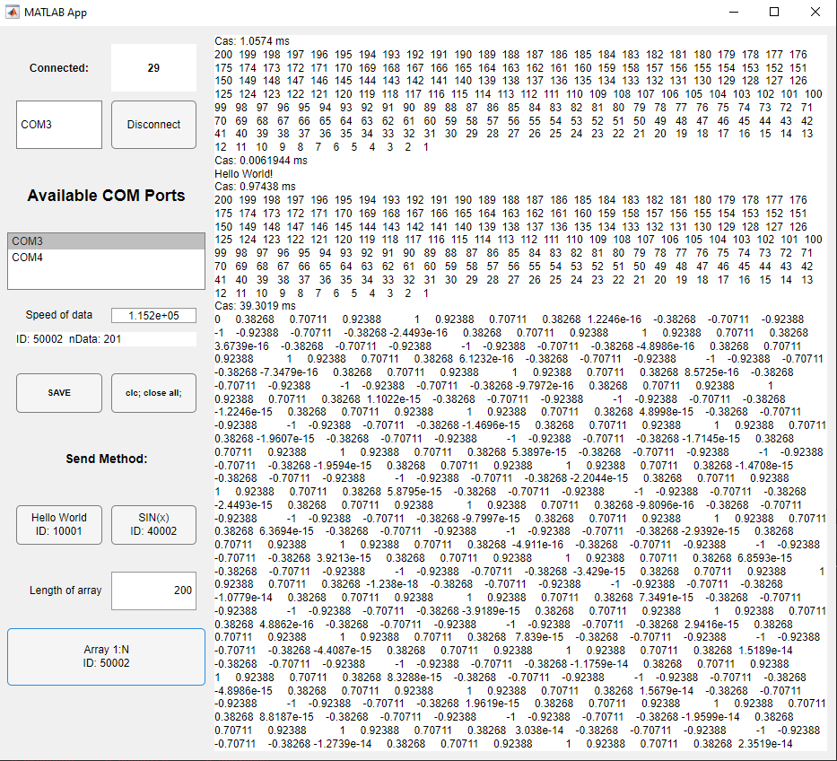

# Testování komunikace mezi mikrokontrollerem STM32F732 a Matlabem pomocí USB FS

## Obsah
1. [Zadání](#1-zadání)  
2. [Technické detaily](#2-technické-detaily)  
    - [2.1 Mikrokontrolér STM32F732RET6](#21-mikrokontrolér-stm32f732ret6)  
    - [2.2 Programátor STLINK-V3MINI](#22-programátor-stlink-v3mini)  
    - [2.3 Vývojová prostředí](#23-vývojová-prostředí)  
3. [Předpoklady](#3-předpoklady)  
4. [Instalace](#4-instalace)  
    - [4.1 STM32CubeIDE](#41-stm32cubeide)  
    - [4.2 MATLAB](#42-matlab)  
5. [Spuštění](#5-spuštění)  
    - [5.1 Spuštění aplikace ve STM32CubeIDE](#51-spuštění-aplikace-ve-stm32cubeide)  
    - [5.2 Spuštění MATLAB aplikace](#52-spuštění-matlab-aplikace)  
6. [Využití](#6-využití)  
    - [6.1 Výběr COM portu a připojení](#61-výběr-com-portu-a-připojení)  
    - [6.2 Odesílání příkazů](#62-odesílání-příkazů)  
    - [6.3 Přenos a zobrazení dat](#63-přenos-a-zobrazení-dat)  

## 1. Zadání
Cílem projektu je seznámit se s modulem obsahujícím mikrokontrolér STM32F732RET6, s vývojem firmwaru v prostředí STM32CubeIDE a s návrhem testovací aplikace v MATLABu. Projekt je zaměřen na komunikaci mezi mikrokontrolérem STM32 a MATLABem prostřednictvím nativního USB Full Speed rozhraní, které je integrované v čipu.

Součástí úkolu je implementace měření časových úseků pomocí 32bitového časovače a návrh ukázkové aplikace, která umožní testování různých rychlostí datového toku mezi STM32 a MATLABem. Cílem je ověřit spolehlivost přenosu a chování systému při různých objemech dat.

## 2. Technické detaily

### 2.1. Mikrokontrolér STM32F732RET6

Pro projekt byl použit mikrokontrolér **STM32F732RET6** od firmy STMicroelectronics, který je osazen na vývojové desce. Jedná se o výkonný 32bitový čip založený na jádru **ARM® Cortex®-M7** s taktovací frekvencí až **216 MHz**. Mikrokontrolér je vybaven jednotkou **FPU**, adaptivním akcelerátorem **ART** a **8 KB L1 cache** pro instrukce i data. Dosahuje výkonu až **462 DMIPS**.

**Paměť:**
- 512 KB Flash
- 256 KB SRAM
- 4 KB zálohované SRAM
- Podpora pro externí paměti (SRAM, SDRAM, NAND, NOR)

**Napájení a hodiny:**
- Rozsah napájení: 1,7V – 3,6V
- USB napájení
- Různé zdroje hodin (interní RC, krystal 4–26 MHz)

**Periferie:**
- 3× 12bit ADC (24 kanálů, až 7,2 MSPS)
- 2× 12bit DAC
- Až 18 časovačů (2× 32bit, 13× 16bit)
- Až 140 I/O pinů, z toho 136 rychlých I/O (až 108 MHz) a 138 5V-tolerantních
- Až 21 komunikačních rozhraní: I²C, UART, SPI, CAN, SDMMC, USB 2.0 FS/HS
- Hardwarová podpora pro AES (128/256bit), RNG, CRC
- RTC s kalendářem, 96bit unikátní ID

*Obrázek 2.1: Mikrokontrolér STM32F732RET6*

---

### 2.2 Programátor STLINK-V3MINI

K nahrávání firmwaru a ladění aplikace byl použit programátor **STLINK-V3MINI (LKV3MINI$AT2)** od STMicroelectronics. Jedná se o kompaktní ladicí a programovací nástroj určený pro mikrokontroléry řady STM32.

#### Klíčové vlastnosti:
- **Rozhraní**:  
  - SWD (Serial Wire Debug)  
  - UART  
- **Rychlost přenosu dat**: až 24 Mbps  
- **Připojení**: 5pinový konektor  
- **Napájení**: přes USB, bez nutnosti externího napájení  
- **Kompatibilita**: STM32CubeIDE, STM32CubeProgrammer  
- **Podpora aktualizace firmwaru**  
- **Využití**: vývoj i servis

*Obrázek 2.2: Programátor STLINK-V3MINI*

---

### 2.3 Vývojová prostředí

#### Embedded část – STM32CubeIDE

Pro vývoj firmware byl použit nástroj **STM32CubeIDE**, který integruje editor kódu, překladač a ladicí nástroje. Pomocí integrovaného rozhraní **STM32CubeMX** lze snadno konfigurovat periferní zařízení, jako jsou časovače, USB nebo GPIO.

- **Programovací jazyk**: C  
- **Knihovny**: STM32 HAL (Hardware Abstraction Layer)  
- **Ladění**: pomocí JTAG/SWD rozhraní  
- **Generování kódu**: automatická inicializace periferií, podpora USB CDC, časovače, atd.

---

#### Aplikační část – MATLAB + App Designer

Pro návrh uživatelského rozhraní a komunikaci s mikrokontrolérem byl na straně PC použit **MATLAB** a nástroj **App Designer**. Výsledná GUI aplikace umožňuje snadné ovládání zařízení a vizualizaci přijatých dat.

- **Komunikace**: Virtuální COM port (USB CDC)  
- **Datová struktura**: pevně definované pakety s identifikátory (ID)  
- **Funkcionalita aplikace**:  
  - Odesílání příkazů  
  - Příjem a dekódování dat  
  - Zobrazení dat pomocí grafů a číselných výstupů  
- **Výhody**: široká knihovna funkcí pro sériovou komunikaci, analýzu a zpracování dat

---
Pro obě vývojová prostředí – **STM32CubeIDE** i **MATLAB** – byla využita školní licence poskytnutá univerzitou.

## 3. Předpoklady

Před samotnou instalací a spuštěním aplikace je nutné mít připravené následující komponenty a nástroje:

### Hardwarové vybavení
- Vývojovou desku s mikrokontrolérem **STM32F732RET6**
- Programátor **STLINK-V3MINI** s odpovídajícím kabelem
- Počítač s volným USB portem

### Software a účty
- Přístup k internetu pro stažení potřebných nástrojů
- Uživatelský účet s oprávněním instalovat software

### Potřebné nástroje
1. **STM32CubeIDE**  
   - Ke stažení z oficiálního webu STMicroelectronics:  
     [https://www.st.com/en/development-tools/stm32cubeide.html](https://www.st.com/en/development-tools/stm32cubeide.html)

2. **MATLAB** s podporou App Designer  
   - Doporučuje se použít verzi MATLAB R2023b nebo novější  
   - Ke stažení z oficiálního webu MathWorks:  
     [https://www.mathworks.com/products/matlab.html](https://www.mathworks.com/products/matlab.html)  
   - Je vyžadována licence (školní licence obvykle postačuje)

3. **Repozitář projektu**  
   - Zdrojové soubory (firmware + MATLAB GUI) dostupné na GitHubu:  
     [https://github.com/VolodymyrCherniakov/STM32-Matlab-Projekt](https://github.com/VolodymyrCherniakov/STM32-Matlab-Projekt)

## 4. Instalace

### 4.1 STM32CubeIDE

1. Stáhněte a nainstalujte vývojové prostředí **STM32CubeIDE** z oficiálních stránek STMicroelectronics.
2. Navštivte repozitář projektu na GitHubu: [https://github.com/VolodymyrCherniakov/STM32-Matlab-Projekt](https://github.com/VolodymyrCherniakov/STM32-Matlab-Projekt) a stáhněte archiv **F732.zip**.
3. Rozbalte obsah archivu do pracovního adresáře pro projekty v CubeIDE.
4. Připojte mikrokontrolér **STM32F732RET6** a programátor **STLINK-V3MINI** k počitači.

5. Načtěte projekt v CubeIDE pomocí souboru `.project` a otevřete soubor `F732/Core/Src/main.c`.
6. Přejděte do **Debug Configurations**:
   
   *Obrázek 4.1: Jak najít Debug Configurations*

7. V zobrazeném okně zvolte vhodný debugger.
8. Nastavte typ debuggeru na **ST-LINK (OpenOCD)**.
9. Klikněte na **Apply** pro uložení konfigurace.
   
   *Obrázek 4.2: Jak nastavit Debug Configurations*
10. Tím je instalace a konfigurace prostředí STM32CubeIDE dokončena.

---

### 4.2 MATLAB

1. Nainstalujte program **MATLAB** (doporučena verze s podporou nástroje App Designer).
2. Ve stejném GitHub repozitáři stáhněte obsah složky `Matlab`.
3. Zkopírujte všechny skripty do pracovního adresáře MATLABu.
4. Otevřete soubor `MatlabTestApp.mlapp` v MATLABu pomocí App Designeru.
   
   *Obrázek 4.3: MatlabTestApp.mlapp v GUI MATLABu*

5. Instalace MATLAB aplikace je tímto dokončena.

---

## 5. Spuštění

Po úspěšné instalaci vývojových nástrojů a nahrání projektu pokračujte následujícím způsobem:

### 5.1 Spuštění aplikace ve STM32CubeIDE

1. Připojte mikrokontrolér **STM32F732RET6** a programátor **STLINK-V3MINI** k počítači přes USB.

2. V **STM32CubeIDE** otevřete pracovní adresář s projektem.
3. Otevřete hlavní soubor firmwaru:  
   `F732/Core/Src/main.c`
4. Klikněte na ikonu brouka **Debug** v horním panelu:  
   
   *Obrázek 5.1: Jak nastartovat Debug*
5. Po načtení ladicího režimu spusťte firmware kliknutím na zelený trojúhelník nebo stiskněte klávesu **F8**:  
   
   *Obrázek 5.2: Jak spustit Debug po startu programu*

### 5.2 Spuštění MATLAB aplikace

6. V **MATLABu** otevřete pracovní adresář, ve kterém se nacházejí všechny skripty projektu.
7. Otevřete soubor `MatlabTestApp.mlapp` v **App Designeru**.
8. Spusťte aplikaci kliknutím na zelený trojúhelník v horním panelu App Designeru, nebo stiskněte **F5**:  
   
   *Obrázek 5.3: Jak spustit MatlabTestApp.mlapp*

Po spuštění se aplikace automaticky pokusí připojit k virtuálnímu COM portu a inicializovat komunikaci s mikrokontrolérem. Načtená data by se měla zobrazit v reálném čase v grafickém rozhraní MATLAB aplikace.

## 6. Využití

Po spuštění MATLAB aplikace (viz kapitola 5) pokračujte následovně:

### 6.1 Výběr COM portu a připojení

1. V levé části aplikace v sekci **Available COM Ports** vyberte správný COM port – typicky označený jako *Sériové zařízení USB* ve Správci zařízení systému Windows.
2. V poli **Speed of data** můžete upravit přenosovou rychlost (baud rate). Výchozí hodnota je **115200** – vyšší hodnota umožní rychlejší přenos, ale závisí na podpoře zařízení.
   
   *Obrázek 6.1: Vyběr COM portu*

3. Klikněte na tlačítko **Connect**. Pokud je spojení úspěšné, začne v poli **Connected** nad tlačítkem běžet čítač přijatých zpráv – to znamená, že komunikace se STM32 funguje správně.
4. Pomocí tlačítka **SAVE** můžete uložit aktuálně vybraný COM port a přenosovou rychlost. Při příštím spuštění aplikace se tyto hodnoty automaticky načtou, což urychlí připojení.
   
   *Obrázek 6.2: Spravné připojení*

---

### 6.2 Odesílání dat do STM32

V sekci **Send Method:** se nacházejí tři tlačítka, pomocí kterých můžete odesílat různé datové sady:

- **Hello World** *(ID: 10001)* – odešle jednoduchý textový řetězec „Hello World!“.
- **SIN(x)** *(ID: 40002)* – vygeneruje sinusový signál o délce 10 000 vzorků a odešle jej do STM32.
- **Array 1:N** *(ID: 50002)* – odešle pole čísel od 1 do N. Hodnotu N nastavíte v poli **Length of array**, výchozí hodnota je 500.

---

### 6.3 Zpracování a zpětný přenos

Při odeslání dat STM32 provede následující:

1. Uloží čas přijetí prvního paketu.
2. Po zpracování dat těsně před odesláním odpovědi uloží druhý čas.
3. Výsledný rozdíl – **doba zpracování** – je připojen jako poslední prvek datového pole, které STM32 odešle zpět.

---

### 6.4 Zobrazení výsledků

- **Přijatá data** se zobrazují ve **výstupní oblasti vpravo** – to je tzv. konzole aplikace. Tato oblast slouží pouze k zobrazení, **nelze do ní zapisovat**.
- **Informace o přijaté zprávě** – konkrétně **ID** a **nData** (počet datových prvků) – se zobrazují **v okénku přímo pod nastavením přenosové rychlosti**.

*Obrázek 6.3: Výstupní oblast*
---
[Zpět na obsah](#obsah)
